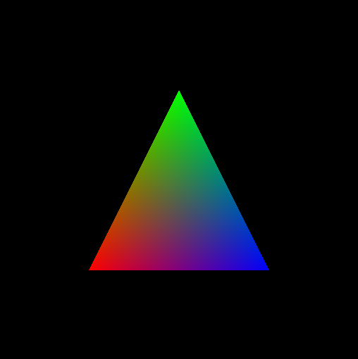

# ICG
Repositório para abrigar as atividades desenvolvidas na disciplina de Introdução à Computação Gráfica

# OpenGL - Atividade 01 (Modern e Old OpenGL Hello World)

> O trabalho é referente a primeira atividade da disciplina de Introdução a Computação Gráfica. O programa deverá apresentar uma janela contendo um triangulo colorido.


[](https://www.opengl.org)


## Objetivos
<ol>
    <li>Verificar se o ambiente de desenvolvimento em OpenGL 3.3 está com o funcionamento correto na máquina local;</li>
    <li>Exemplificar o funcionamento do OpenGL moderno e do antigo através de exemplos;</li>
</ol>

## Dificuldades encontradas

Dificuldade em renderizar as cores à imagem de saída usando o Ubuntu 18.04. Para resolver a dificuldade foi necessário colar no terminal o seguinte comando: 

```sh
$ export MESA_GL_VERSION_OVERRIDE=3.3
```
## Pré-requisitos

Caso esteja no Ubuntu, rode os seguintes comandos no terminal para instalar o OpenGl:

```sh
$ sudo apt-get update
$ sudo apt-get install libglu1-mesa-dev freeglut3-dev mesa-common-dev
```

## Utilização

Para executar o código deve-se criar o arquivo compilado para ser executado:

```sh
$ cd modern_opengl/
$ gcc main.c -o [nome executável] -lglut -lGLU -lGL
```

Após isso, basta executar o programa:
```sh
$ ./[nome executável]
```
### Aluna
<ul>
    <li>Luciana Serrão e Silva – 2016085380 – luliserrao@eng.ci.ufpb.br</li>
</ul>
