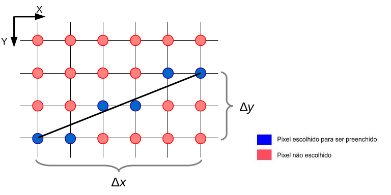
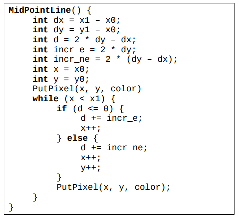
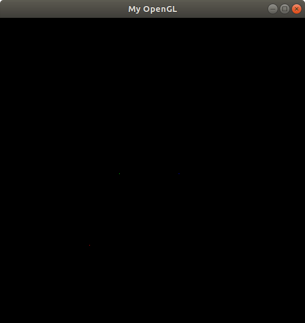
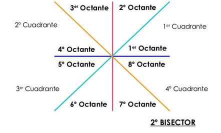
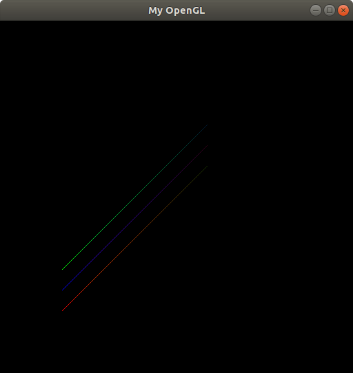
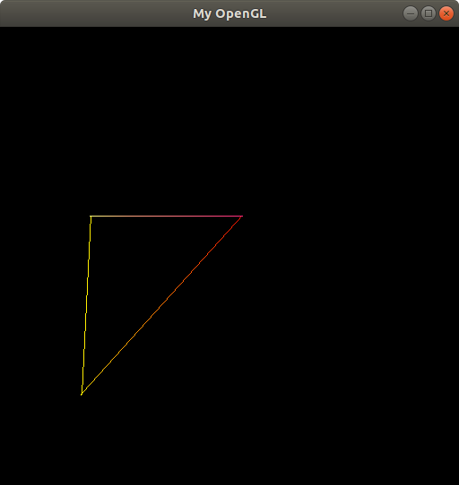

# ICG

## Line Raster : Atividade 2 (Rasterização de pontos e linhas e interpolação de cores)

> O trabalho é referente a segunda atividade da disciplina de Introdução a Computação Gráfica.O objetivo deste trabalho é implementar funções usando algoritmos de rasterização, que exibam pontos e retas na tela.
> As funções são referenciadas dentro de uma função pre-definida __void MyGlDraw(void)__.
> Para simular o acesso direto à memória de vídeo , foi utilizado o framework fornecido pelo professor Christian Azambuja Pagot.

### Introdução: O conceito de rasterização, o que são pixels e do que são formados
> A rasterização é um processo de converter primitivas matemáticas (pontos, retas, polígonos ou quaisquer objetos do plano cartesiano) em pixels e desenhá-los na tela.
> Nesse processo, acontece a escolha dos pixels que serão “pintados” na tela, com coordenadas e cores específicas, como na imagem abaixo:



## Rasterização de um ponto na tela
> A tela de um monitor raster é representada por uma matriz com linhas e colunas, onde cada elemento dessa matriz é um __pixel__, que está associado a um endereço de memória. Todo os pixels podem ser representados por um par ordenado de valores inteiros X e Y.
> Para a coloração dos pixels o sistema de cores mais usado é o RGBA (R de Red, G de Green, B de Blue e A de Alpha), em que Alpha corresponde à transparência.Cada componente desse sistema é associado a  1 byte de memória, logo, cada pixel contém __4 bytes__ . 

## Rasterização de uma linha na tela
> Para rasterizar uma linha é necessário determinar quais pixels devem ser coloridos a partir de duas coordenadas (x,y) fornecidas. Para isso foi feito uso do __Algoritmo de Bresenham__ ou também conhecido como o __Algoritmo do Ponto Médio__ descrito a seguir:


> Entretanto, a solução proposta acima é limitada para inclinações até 45º e isso faz com que ela sirva bem para o primeiro octante. 

## Interpolação Linear
> A interpolação linear é feita quando adiciona-se um efeito visual, utilizando um gradiente de cores entre dois pontos do segmento de reta, ou seja, a cor muda suavemente ao longo da linha variando entre as cores dos pontos inicial e final.
> Para fazer esse efeito, foram feitos os seguintes passos:
<ol>
    <li>Cálculo das variações de cada componente R, G e B das cores dos pontos extremos da reta;</li>
    <li>Divisão do valor pelo número de pixels usados para desenhar a reta(dx ou dy).</li>
    <li>iIncrementou ou decremento dos níveis de intensidade da cor de cada pixel desenhado ao longo da reta</li>
</ol> 

## Funções implementadas:
Primeiramente, foi criada uma estrutura que armazena os elementos de um pixel.
```
typedef struct {
    int x;
    int y;
    int Red;
    int Green;
    int Blue;
    int Alpha;
}pixels;
```
### 1 - putPixel
>Essa função representa pixels a partir do conjunto de coordenadas e cores dadas pelo usuário, utilizando o framework disponibilizado.
```
void putPixel(pixels P){
    
    fb_ptr[(4*P.x) + (4*IMAGE_WIDTH*P.y) + 0] = P.Red; //calculo do offset para a luz vermelha
    fb_ptr[(4*P.x) + (4*IMAGE_WIDTH*P.y) + 1] = P.Green; //calculo do offset para a luz verde
    fb_ptr[(4*P.x) + (4*IMAGE_WIDTH*P.y) + 2] = P.Blue; //calculo do offset para a luz azul
    fb_ptr[(4*P.x) + (4*IMAGE_WIDTH*P.y) + 3] = P.Alpha; //calculo do offset para a luz transparente
}
```

“[4 * x + 4 * y * IMAGE_WIDTH + 0]” - É o cálculo do offset(deslocamento), determinando a posição certa das cores RGBA na memória de vídeo..

> A função foi referenciada em void MyGlDraw(void) da forma seguinte:

```
void MyGlDraw(void) {
    pixels P1 = {150, 130, 255, 0, 0, 255};  //ponto vermelho na posicao (150,130)
    pixels P2 = {200, 250, 0, 255, 0, 255}; //ponto verde na posicao (200,250)
    pixels P3 = {300, 280, 0, 0, 255, 255}; //ponto azul na posicao (300,280)

    //testando pontos
    putPixel(P1);    
    putPixel(P2);    
    putPixel(P3);

        ...

```


### 2 - drawLine
> Essa função processa a rasterização de linhas, a partir de um ponto inicial e um ponto final. Para tal, foi utilizado o algoritmo de Bresenham. 



> O algoritmo tem a limitação de funcionalidade apenas para o primeiro octante. Por isso, foram feitas adaptações matemáticas no algoritmo para que ele abrangisse os 8 octantes de forma correta. Assim, a função foi referenciada em void MyGlDraw(void) da forma seguinte:

```
void MyGlDraw(void) {
    //testando linhas

    pixels P1 = {90, 90, 255, 0, 0, 255};  //ponto vermelho na posicao (90, 90)
    pixels P2 = {300, 150, 0, 255, 0, 255}; //ponto verde na posicao (300, 150)
    pixels P3 = {90, 120, 0, 0, 255, 255}; //ponto azul na posicao (90, 120)
    pixels P4 = {300, 180, 255, 0, 0, 255};  //ponto vermelho na posicao (150,130)
    pixels P5 = {90, 150, 0, 255, 0, 255}; //ponto verde na posicao (90, 150)
    pixels P6 = {300, 210, 0, 0, 255, 255}; //ponto azul na posicao (300,250)
    
    drawLine(P1,P2);
    drawLine(P3,P4);
    drawLine(P5,P6);

        ...

```


### 3 - DrawTriangle
>Depois de implementar a rasterização de retas, desenhar um triângulo torna-se uma tarefa simples. Tendo em vista que todo triângulo é formado por três retas que se conectam. Assim, a função foi referenciada em void MyGlDraw(void) da forma seguinte:
```
void MyGlDraw(void) {
    pixels P1 = {100, 300, 255, 255, 127, 0};  //ponto vermelho na posicao (150,130)
    pixels P2 = {90, 100, 255, 238, 0, 0}; //ponto verde na posicao (216,250)
    pixels P3 = {270, 300, 255, 0, 176, 0}; //ponto azul na posicao (300,250)

    DrawTriangle(P1,P2,P3);
}
```



## Resultados e dificuldades encontradas
>O trabalho conseguiu foi executado completa e corretamente, apresentando resultados coerentes. 
Uma das dificuldades foi a difusão do algoritmo de Bresenham para todos os octantes.

## Referências

https://slideplayer.com.br/slide/366939/https://slideplayer.com.br/slide/366939/

http://disciplinas.ist.utl.pt/leic-cg/textos/livro/Rasterizacao.pdf

### Aluna
<ul>
    <li>Luciana Serrão e Silva – 2016085380 – luliserrao@eng.ci.ufpb.br</li>
</ul>

